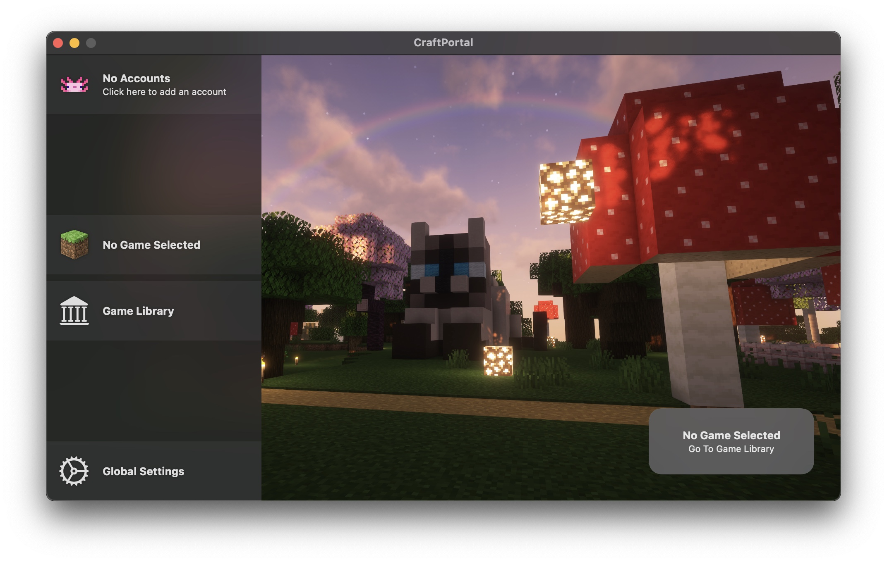

# CraftPortal

This is a WIP Minecraft launcher for MacOS in SwiftUI. It is a simple launcher that aims to provide space efficiency while providing supports to isolated game profiles.

## Roadmap

- [X] Basic UI
- [x] Launch script generation
- [X] global settings
- [ ] Per game settings
- [ ] Player login
- [ ] Game download
- [ ] Game integraty check and JVM version check
- [ ] Pipe game logging to the app
- [ ] Mod downloads and management
- [ ] Better UI and animations

## Screenshots

